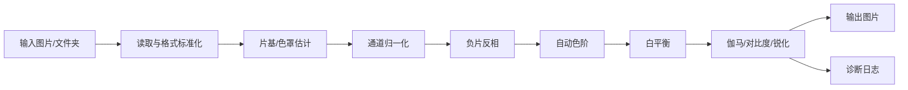

# 技术方案

## 1. 总体架构



## 2. 核心算法

### 2.1 片基色估计

彩色负片的橙色片基通常出现在未曝光边框区域。最可靠方式是从胶片边框取样。

估计优先级：

1. 如果用户选择 `manual`，直接使用用户输入 RGB。
2. 如果用户选择 `border`，从图像四周边框估计。
3. 如果用户选择 `auto`，先尝试边框估计；边框不可靠时回退到高亮像素估计。
4. 如果用户选择 `percentile`，从图像高亮区域估计。

边框估计方法：

- 取图片上下左右一定比例边缘像素。
- 按亮度筛选较亮区域。
- 使用中位数而不是平均数，降低灰尘、字码、齿孔、划痕影响。

### 2.2 通道归一化与反相

对每个通道单独处理：

```text
normalized_negative = (negative - black) / (mask - black)
positive = 1 - normalized_negative
```

其中：

- `negative` 是扫描输入。
- `mask` 是估计到的片基高端。
- `black` 是负片扫描中的低端密度。
- `positive` 是初步正片。

### 2.3 自动色阶

使用百分位估计黑白点：

- 黑点默认取 1% 左右。
- 白点默认取 99.5% 左右。
- 分通道拉伸，避免单通道色偏。

### 2.4 白平衡

第一版使用灰世界白平衡：

- 排除接近纯黑和纯白的像素。
- 计算 RGB 平均值。
- 将三个通道拉向相同平均亮度。
- 限制增益范围，避免极端图片被过度校正。

后续可以加入：

- 中性灰取样点。
- 人脸肤色约束。
- 同卷多图统计。

### 2.5 胶片响应曲线

RawTherapee 的负片工具指出，负片每个 RGB 通道的响应可能与胶片类型、老化、拍摄条件有关。因此第二阶段应加入：

- 参考指数，控制整体对比。
- 红通道指数比例。
- 蓝通道指数比例。
- 每卷胶片预设保存。

## 3. 技术选型

### 3.1 第一阶段

| 模块 | 技术 | 原因 |
|---|---|---|
| 核心算法 | Python + NumPy | 数值处理直接，迭代快 |
| 图片读写 | Pillow | 支持常见图片格式，依赖轻 |
| 命令行 | argparse | 标准库，无额外依赖 |
| 文档 | Markdown | 易维护，适合项目初期 |

### 3.2 GUI 阶段候选

| 方案 | 优点 | 缺点 | 建议 |
|---|---|---|---|
| PySide6 / Qt | 原生桌面体验好，适合图片工具 | 包体大，界面开发稍复杂 | 推荐 |
| Tkinter | 标准库内置，简单 | 视觉和交互较弱 | 只适合极简版 |
| Tauri + Web 前端 | 界面现代，包体小 | Python 算法要桥接 | 后续可考虑 |
| Electron | 前端开发成熟 | 包体较大 | 不作为首选 |

建议：核心算法稳定后，用 PySide6 做桌面 GUI。

## 4. 文件结构建议

```text
film-mask-automation/
  pyproject.toml
  README.md
  docs/
    00_项目总览.md
    01_需求规格说明书.md
    02_技术方案.md
    03_详细实施计划.md
    04_测试计划.md
  src/
    film_mask_automation/
      __init__.py
      processor.py
      cli.py
      diagnostics.py
      presets.py
      gui/
        app.py
        main_window.py
  tests/
    test_processor.py
    test_cli.py
  samples/
    input/
    output/
```

## 5. 风险与对策

| 风险 | 影响 | 对策 |
|---|---|---|
| 无胶片边框导致片基估计不准 | 输出偏色 | 提供高亮估计和手动 RGB |
| 过曝/欠曝图片色阶异常 | 黑白点错误 | 使用稳健百分位和参数覆盖 |
| 老胶片褪色 | 自动白平衡失败 | 增加手动灰点和通道曲线 |
| 不同扫描仪色彩差异 | 批量不一致 | 增加卷级预设和设备预设 |
| 8-bit 输入导致色阶断裂 | 质量下降 | 后续支持 16-bit TIFF |
| GUI 阻塞 | 用户体验差 | 批处理放入后台线程 |

